# Linuxのインストールと設定
第3章では、VirtualBoxで作成した仮想マシンにAlmaLinuxをインストールします。インストール後、初期設定とネットワーク接続の確認を行います。

## 用語集
### ISOイメージ
CD-ROMやDVD-ROMはISO9660という形式でファイルを保存しています。このISO9660形式のディスクをそのまま1つのファイルに保存したものをISOイメージと呼びます。

### ブートローダー
OSの起動時に最初に読み込まれるプログラムです。ブートローダーがLinuxカーネルを読み込んでシステムが起動します。

### パーティション
Linuxはディスクを複数の区画（パーティション）に分割して利用します。データを保存するパーティションの他、仮想メモリが利用するスワップ用のパーティションなどがあります。

### NAT
NAT（Network Address Translation）はIP通信時にIPアドレスを変換して通信を行う仕組みです。IPv4ではインターネットに直接接続できるグローバルIPアドレスが枯渇しているため、1つのグローバルIPアドレスを複数のホストで共有して利用できるようにNATを活用しています。

### root
Linuxのシステム管理者のユーザー名です。

## 仮想マシンの起動
VirtualBoxマネージャーで仮想マシンを選択し、「起動」をクリックします。別ウインドウで仮想マシンが起動します。

### ISOイメージファイルのマウント
あらかじめ仮想マシンの仮想光学ドライブにISOイメージを読み込ませる設定をしていない場合、起動用のISOイメージを設定するダイアログが表示されます。

画面の指示に従って、ISOイメージのファイルを指定し、「マウントとブートのリトライ」ボタンをクリックして起動します。


## OSのインストール
以下の手順に従って、OSのインストールを行います。

### インストーラー起動オプションの選択
OSインストール用のISOイメージを読み込んで起動すると、最初にGRUBというブートローダーが起動します。ここでインストーラーの起動オプションを選択できます。

デフォルトの「Test this media & Install AlmaLinux 9.3」で起動し、ISOイメージが壊れていないかテストを行った上でインストールを行います。すでに選択されているので、Enterキーを押します。

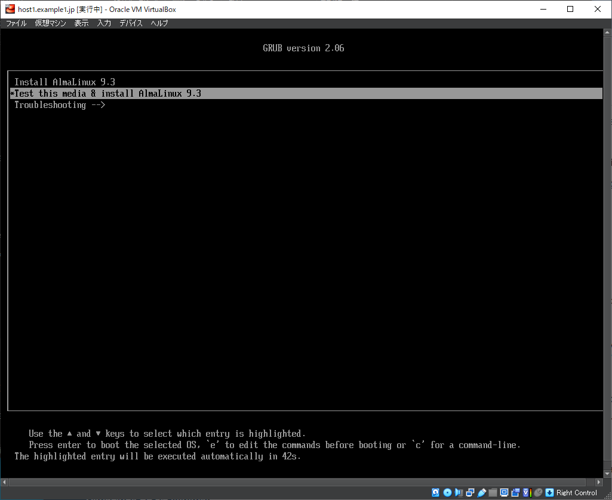

### 言語選択
言語の選択画面が表示されるので、左側のメニューから「日本語 Japanese」を選択します。画面右側のメニューに「日本語（日本）」が表示されます。

「続行」ボタンをクリックします。

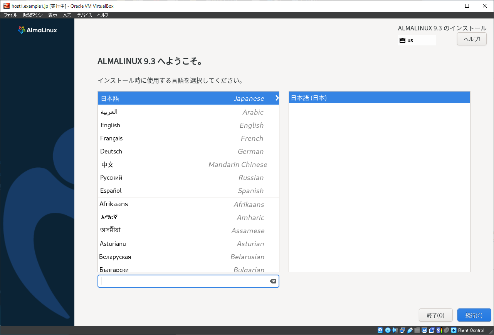

### インストール概要
インストール概要の画面では、各種設定がまとめて表示されます。

「!」が付いた項目は、必ず設定が必要な項目です。


### インストール先の設定
「インストール先」をクリックします。画面が切り替わり、「デバイスの選択」や「ストレージの設定」が行えます。

デフォルトで、仮想マシン作成時に新規作成した仮想ハードディスクがローカル標準ディスクとして選択されています。また、そのデバイスのパーティション設定は自動構成が選択されています。

今回はデフォルトのままインストール先を設定するので、そのまま「完了」ボタンをクリックします。

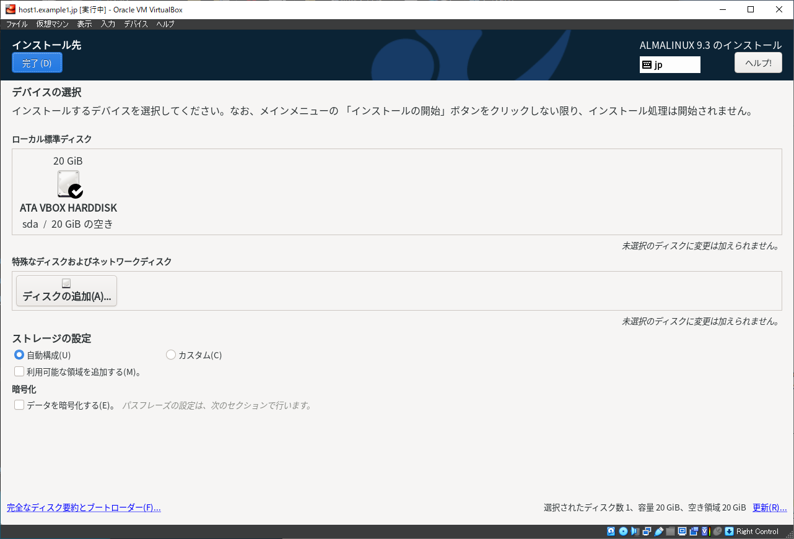

### ネットワークとホスト名の設定
「ネットワークとホスト名」をクリックします。画面が切り替わり、ネットワークインターフェースの設定と、ホスト名の設定が行えます。

仮想マシンの設定で、ネットワークアダプターを2つ設定したので、ネットワークインターフェースが2つ認識されています。

#### インターネットへの接続を設定（NAT）
「Ethernet (enp0s3)」は、NATを設定したアダプター1にあたります。こちらのネットワークインターフェースを経由して、外部ネットワークやインターネットに接続します。

VirtualBoxのNATはDHCPで自動的に設定されるので、以下のように設定されていることを確認します。

| 項目 | 設定値 |
|------------|---------------|
| IPアドレス | 10.0.2.15/24 |
| デフォルトルート | 10.0.2.2 |
| DNS | 環境によって異なる |

DNSは環境によって異なりますが、ホストOS側のネットワーク設定と同じになるので、ホストOSのネットワーク設定を確認して適切な参照先DNSが設定されていることを確認します。

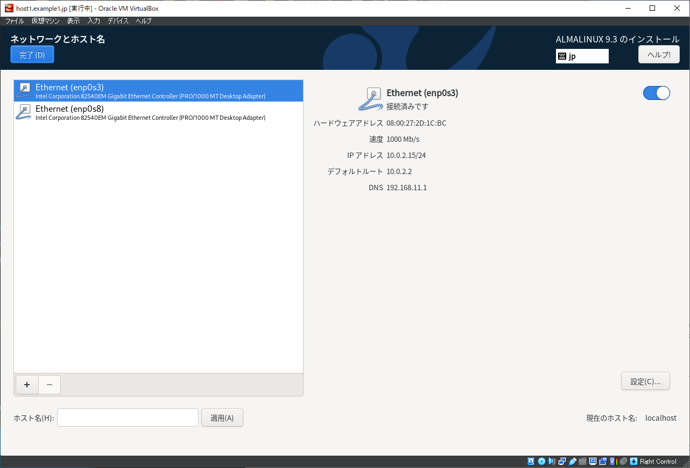

#### ホストOSとの接続を設定（ホストオンリー）
「Ethernet (enp0s8)」は、ホストオンリーを設定したアダプター2にあたります。ホストOSから仮想マシン上で動作するゲストOSに接続します。

VirtualBoxのネットワーク設定でホストオンリーアダプターの設定の際にDHCPサーバーを有効にしていれば、「192.168.56.3」などのIPアドレスが自動的に設定されていますが、サーバーとして使用するため固定IPアドレスを設定します。

1. 「Ethernet (enp0s8)」を選択し、「設定(C)...」をクリックします。

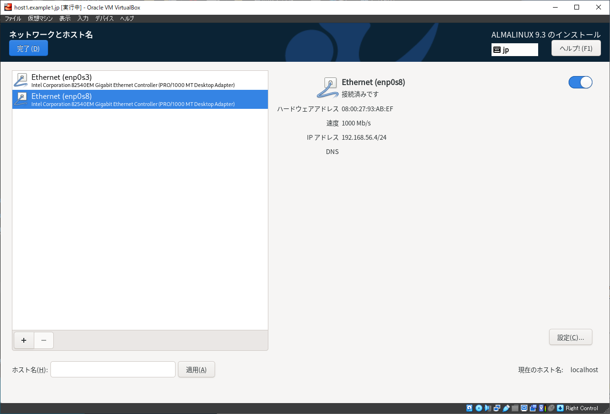

1. 「enp0s8の編集」ダイアログが表示されるので、「IPv4 設定」タブを選択します。
1. 「メソッド(M)」を「手動」に変更します。
1. 「アドレス」で「追加」をクリックし、各項目を以下の値に設定します。

| 項目 | 設定値 |
|------------|---------------|
| アドレス | 192.168.56.101 |
| ネットマスク | 24（自動的に設定される） |
| ゲートウェイ | 設定しない |
| DNSサーバー | 192.168.56.101 |

DNSは自分自身を参照するように「192.168.56.101」を設定します。

1. 「保存(S)」ボタンをクリックします。


### ホスト名の設定
ホスト名を設定します。ホスト名は以下の通り設定します。

| 項目 | 設定値 |
|------------|---------------|
| ホスト名 | host1.example.1.jp |

入力後、「適用(A)」ボタンをクリックします。

「現在のホスト名」の表示が変更されるのを確認します。

2つのネットワークインターフェースおよびホスト名の設定が完了したら、「完了(D)」ボタンをクリックします。

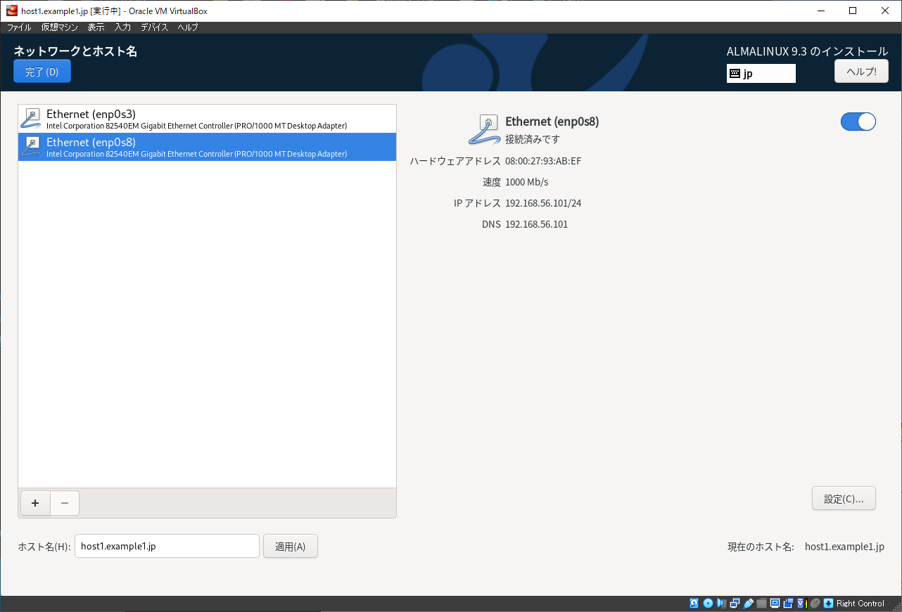

### ソフトウェアの選択
インストールするソフトウェアの種類を選択します。

デフォルトでは「サーバー（GUI使用）」が選択されており、このままインストールします。

必要に応じて、ベース環境として大まかな目的別にインストールしたり、個別のソフトウェアを選択してあらかじめインストールしておくことができます。


### ソフトウェアの追加インストール（インターネット接続ができない場合のみ）
インターネットに接続できない環境の場合、実習で利用するソフトウェアをあらかじめインストールしておきます。

上記「ソフトウェアの選択」画面で、右側の「選択した環境用のその他のソフトウェア」リストから、インストールしたいソフトウェアをチェックします。本教科書の実習のためには、以下のソフトウェアをチェックして追加でインストールします。

- DNSネームサーバー
- メールサーバー
- ベーシックWebサーバー

ただし、これら3つを追加でインストールしても、メールを送受信するためのソフトウェアがインストールされません。それらは別途ISOイメージから手動で追加インストールが必要となります。


### rootパスワードの設定
「rootパスワード(R)」をクリックします。Linuxのシステム管理権限を持つrootユーザーのパスワードを設定します。

rootパスワードは、入力間違えが無いように「rootパスワード(R)」と「確認(C)」に同じパスワードを2回入力します。長さや大文字小文字数字を混ぜるなど一定の要件を満たさないと脆弱なパスワードと判定されます。良好以上になるパスワードを入力するか、脆弱と判定された場合には「完了(D)」ボタンを2回クリックする必要があります。

rootパスワードの設定が完了したら、「完了(D)」ボタンをクリックします。

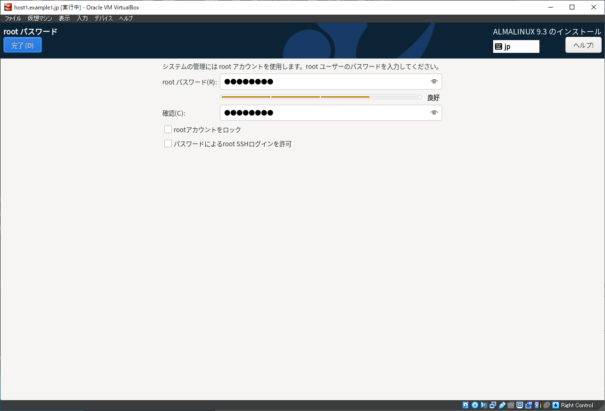

### インストールの開始
必要な設定が終わったら、インストールを開始します。「インストール開始」ボタンをクリックします。

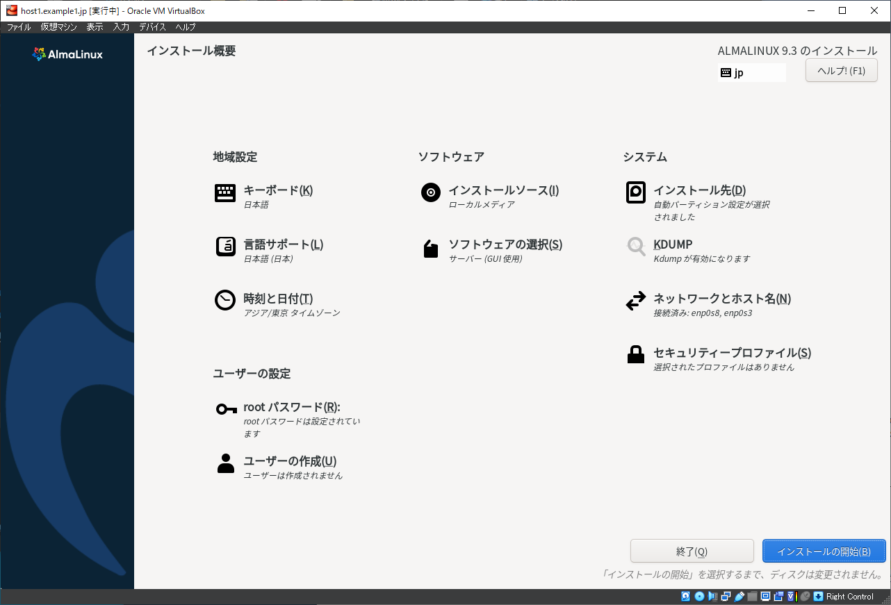

インストールが始まり、「インストール状況の表示」画面が表示されます。

インストールが終了したら、「システムの再起動」ボタンをクリックして、再起動します。

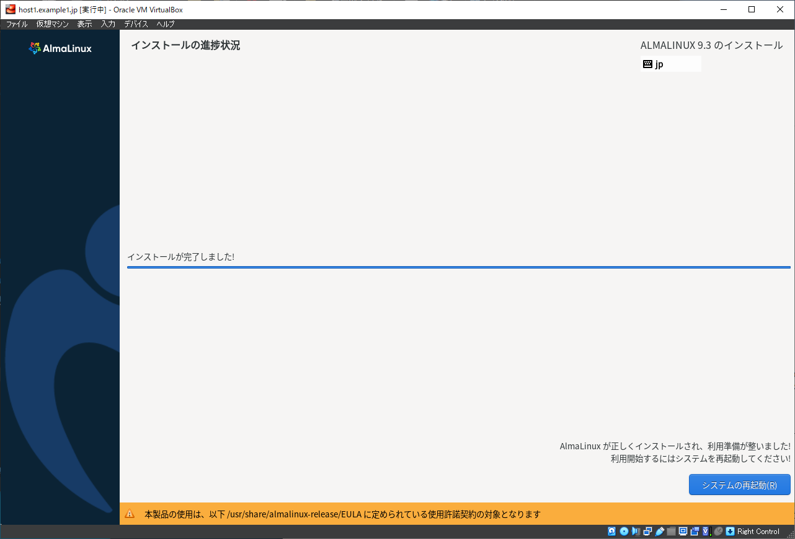

## インストール後の初期設定
再起動ができたら、初期設定を行います。

「セットアップ開始(S)」ボタンをクリックします。

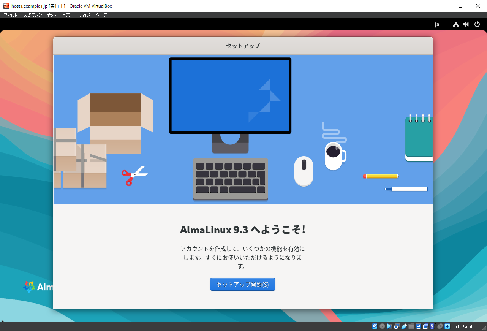

### プライバシー
位置情報サービスを使って情報を提供するかどうかを設定します。

システムの動作には影響がありませんので、設定はオンでもオフでも、どちらでも構いません。

設定したら、「次へ(N)」ボタンをクリックします。

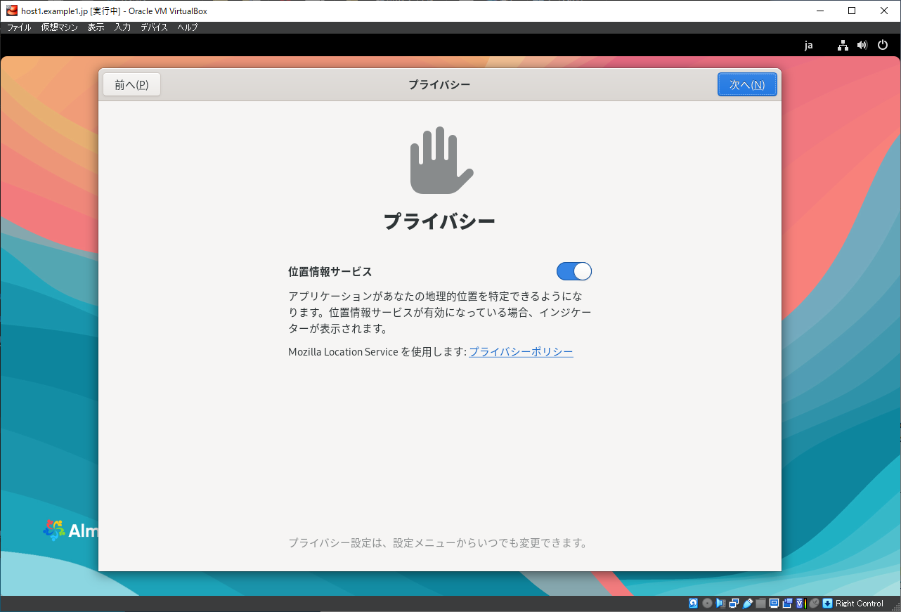

### オンラインアカウント
オンラインアカウントへの接続を設定します。

接続する必要はありませんので、「スキップ(S)」ボタンをクリックします。

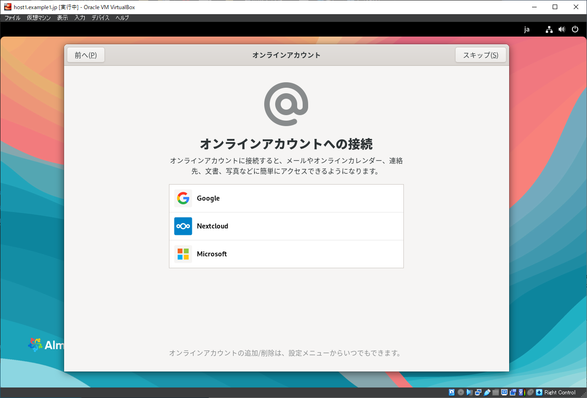

### ユーザー情報
インストール設定時にユーザーを作成していないので、初期ユーザを作成します。演習用のサーバー管理ユーザーとして、以下のように設定します。

| 項目 | 設定値 |
|------------|---------------|
| フルネーム | admin |
| ユーザー名 | admin |

設定したら、「次へ(N)」ボタンをクリックします。


ユーザーadminのパスワードも設定します。rootパスワード同様、「パスワード」と「確認」に同じパスワードを入力します。

設定したら、「次へ(N)」ボタンをクリックします。

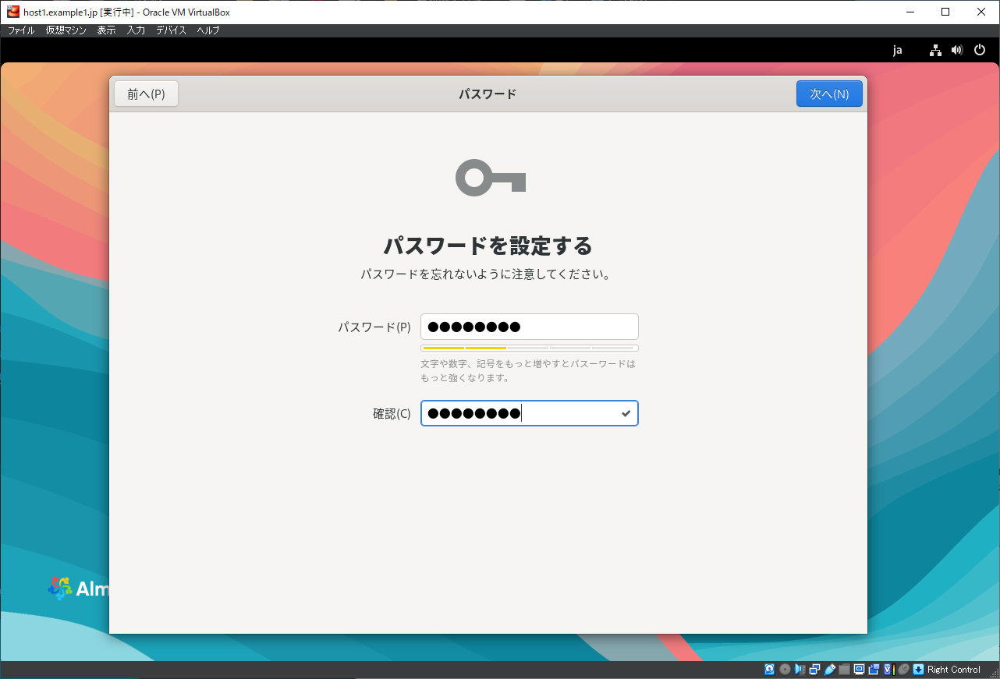

すべての設定を完了したら、「AlmaLinuxを使い始める(S)」ボタンをクリックします。


初期設定画面からGUI画面に切り替わります。「AlmaLinuxへようこそ」と表示され、操作方法を確認するツアーを開始できます。ツアーを見たい場合には「ツアーをチェックする」ボタンをクリックします。はじめてAlmaLinuxのGUIを操作するのであれば、短いツアーですのでチェックしてみてください。


## ログインとログアウト
Linuxを使い始めるにはログインを、使い終わったらログアウトを行います。

現在は、初期ユーザーで自動的にログインした状態なので、一度ログアウトし、再度ログインしてみます。

### ログアウトする方法
ログアウトするには、画面右上にあるメニューバーの電源アイコンをクリックし、「電源オフ/ログアウト」をクリックすると表示される「ログアウト」をクリックします。

ログアウトを確認するダイアログが表示されるので、「ログアウト」をクリックします。

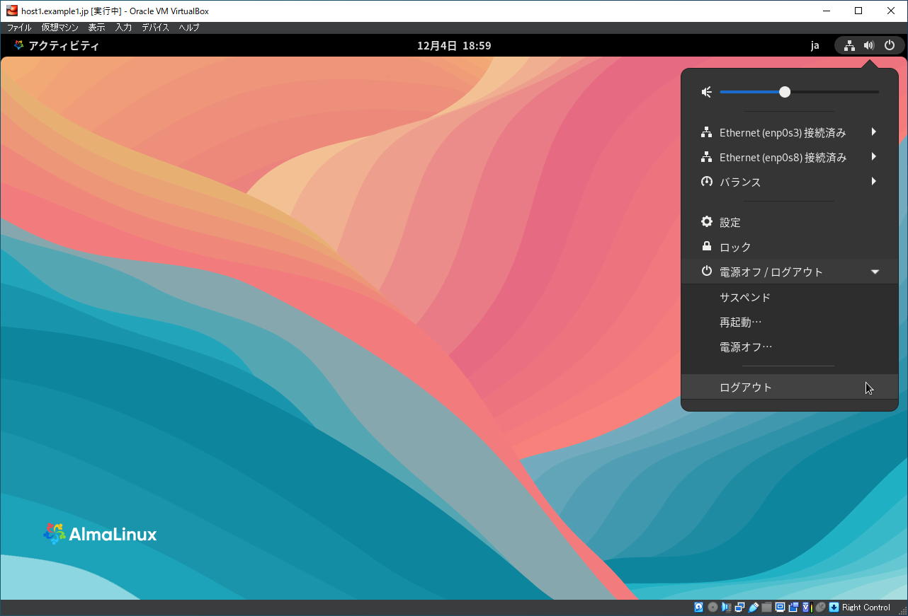

### ログインする方法
ログインするには、ログインしたいユーザーをクリックして選択し、パスワードを入力します。

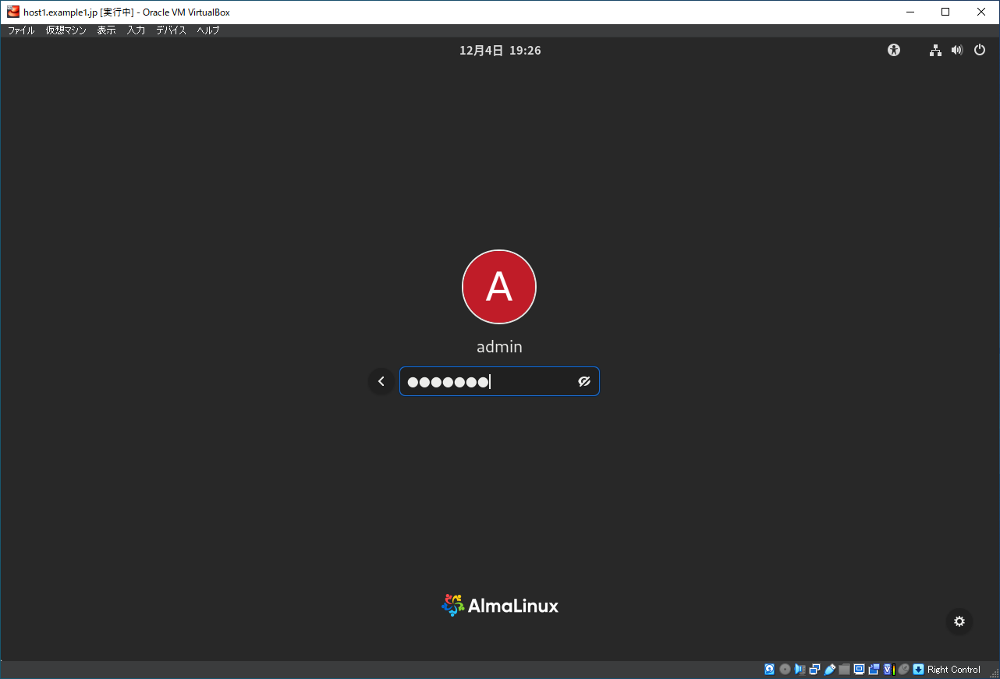

## コマンド実行のための端末を起動
コマンドを実行してLinuxを操作するために「端末」アプリを起動します。

画面左上の「アクティビティ」をクリックし、画面下に表示されるアイコンから「端末」アプリのアイコンをクリックします。

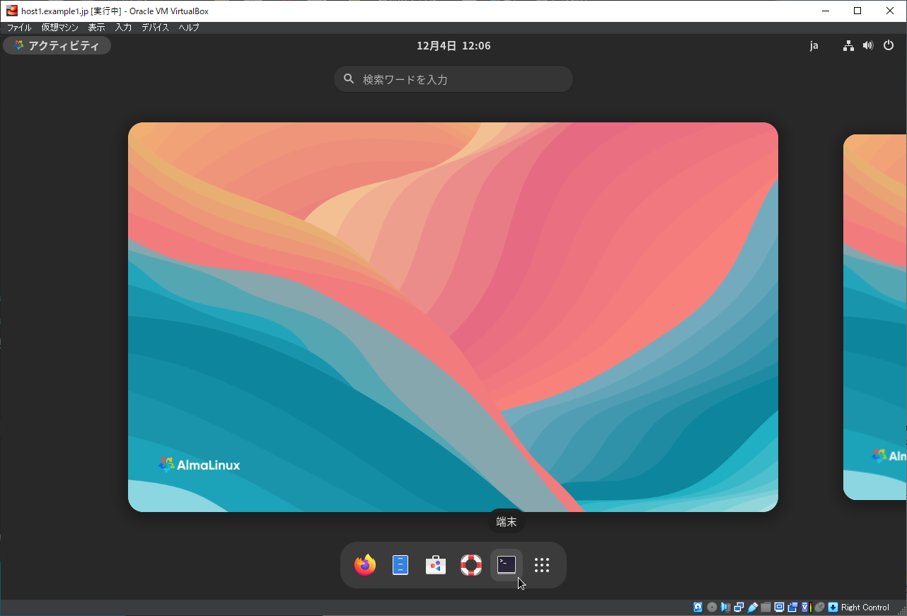

また、仮想マシンで直接操作するのではなく、ホストOSからSSHを使ってリモート接続して操作することもできます。方法については第7章で解説します。

## ネットワーク接続の確認
ネットワークに正しく接続されているかの確認を行います。ネットワークはNATを経由した外部ネットワークやインターネットの接続と、ホストオンリーネットワークを経由したホストOSとの接続があります。それぞれについてテストします。

### インターネット接続
インターネットとの接続は、名前解決およびインターネット上のサーバーへ到達できるかを確認します。

#### 名前解決の確認
digコマンドを使って、DNSによる名前解決を確認します。

```
$ dig lpi.or.jp
```

#### インターネットへの接続の確認
Pingコマンドを使って、インターネット上のサーバーへの接続を確認します。

```
$ ping lpi.or.jp
```

pingコマンドでの接続に対する応答を返さないサーバーもあるので、返答が無い場合にはその他のサーバーへの接続も試してみるか、LinuxのGUIでWebブラウザを起動してWebサイトへ接続するなども試してみるとよいでしょう。

### ホスト接続
ホストOSとゲストOSの間での接続を確認します。

#### ゲストOSからホストOSへの接続の確認
pingコマンドで、ホストOSへの接続を確認します。ホストOS側のIPアドレスは、VirtualBoxのネットワーク設定で確認した「192.168.56.1」になります。

```
$ ping 192.168.56.1
★実行結果を追加
```

#### ホストOSからゲストOSへの接続の確認
ホストOS側でコマンドプロンプトを起動して、pingコマンドでゲストOSへの接続を確認します。ゲストOS側のIPアドレスは「192.168.56.101」になります。

1. 画面左下の「ここに入力して検索」に「cmd」と入力します。
1. 「コマンドプロンプト」が検索されるので、クリックして起動します。
1. pingコマンドを実行します。

```
> ping 192.168.56.101
```

1. 確認が行えたらCtrl+Cを入力して動作を停止します。

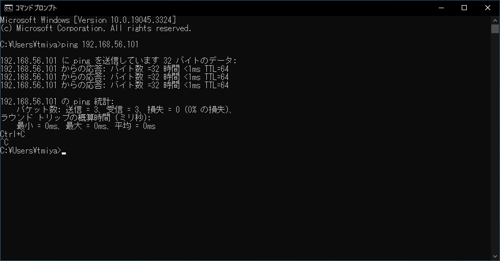

