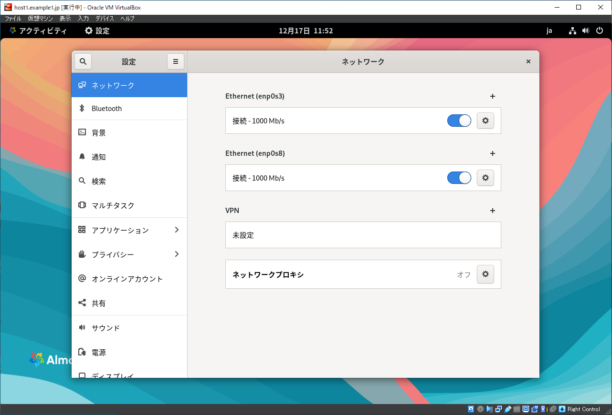
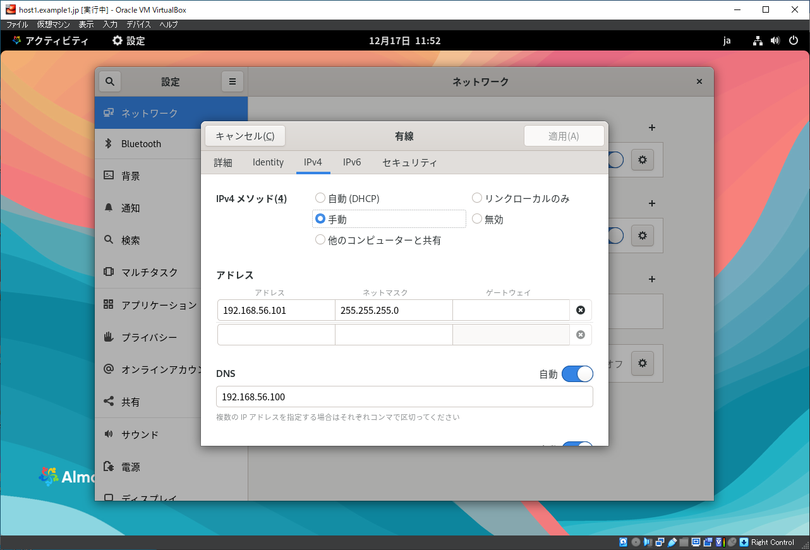

#  ネットワークとセキュリティの設定
第7章では、ネットワークとセキュリティの設定についてあらためて確認します。AlmaLinuxでは、基本的なネットワークやセキュリティの設定はインストール時に行われます。ここでは、これらをOSインストール後に設定する方法について説明します。

## 用語集
### ネットワークインターフェース {.unlisted .unnumbered}
LANケーブルを接続して、外部のマシンとの間でデータをやり取りするための物理的なインターフェースです。

### ループバックインターフェース {.unlisted .unnumbered}
マシン内部でデータをやり取りするための仮想的なインターフェースです。

### IP（Internet Protocol） {.unlisted .unnumbered}
IPは、ネットワークに接続したコンピューター間でデータをやり取りするためのプロトコルです。

### IPアドレス {.unlisted .unnumbered}
IPアドレスは、IP通信で各コンピューターに割り当てられる値です。データの送り先としてIPアドレスを指定すると、そのIPアドレスが割り当てられたコンピューターに送信されたデータが届きます。

### IPv4（Internet Protocol version 4） {.unlisted .unnumbered}
現在のインターネットで利用されている通信プロトコルです。IPv4では、IPアドレスを4バイト（32ビット）で表します。本来は32個の2進数（0と1）の羅列ですが、人間に分かりやすくするために1バイトごとに10進数に変換して . （ドット）で区切って「192.168.1.1」の様に表記します。
次世代のIPであるIPv6では、IPアドレスを128ビットで表します。

### ネットワークアドレス {.unlisted .unnumbered}
ホストが属しているネットワーク自体を指し示すIPアドレスです。

### ブロードキャストアドレス {.unlisted .unnumbered}
ホストが属しているネットワーク全体を指し示すIPアドレスです。

### ネットマスク {.unlisted .unnumbered}
IPアドレスのうち、どこまでがネットワーク部で、どこまでがホスト部かを示すための値です。IPアドレスとネットマスクの2つの値から、ネットワークアドレス、ブロードキャストアドレスを割り出すことができます。

### デフォルトゲートウェイ {.unlisted .unnumbered}
インターネットは、小さなネットワークが相互に接続したネットワークです。小さなネットワーク間を接続する機器としてルーター（ゲートウェイ）が使われます。ゲートウェイは1つのネットワークに複数設置することができますが、特に指定が無い場合にはデフォルトゲートウェイを使って外部のネットワークとの通信を行います。

### DHCP（Dynamic Host Configuration Protocol） {.unlisted .unnumbered}
IPアドレスなどのネットワーク設定を自動的に割り当てるプロトコルです。

### TCP（Transmission Control Protocol） {.unlisted .unnumbered}
TCPは、コネクション方式で通信するプロトコルです。IPと組み合わせたTCP/IPがインターネットの標準的な通信プロトコルです。TCPの特長として、届かなかった通信パケットを再送信して確実に通信を行う仕組みがあります。

### UDP（User Datagram Protocol） {.unlisted .unnumbered}
UDPは、コネクションレス方式で通信するプロトコルです。TCPとは異なり、データの再送信が行われないので通信の確実性は劣りますが、セッションを確立するための「3ウェイハンドシェイク」の手間が不要なためシンプルな通信に適しています。たとえば、大量に問い合わせが行われるDNSへの名前解決の問い合わせはUDPとなっています。

### ポート番号 {.unlisted .unnumbered}
ポート番号は、TCPとUDPが通信する際に使用する値です。たとえばWebサーバーはポート番号80番を使用して動作しているので、Webブラウザーは目的のWebサーバーのポート番号80番に接続します。ポート番号は0番から65535番まで使用できますが、0〜1023番はWELL KNOWN PORT、1024〜49151番はREGISTERED PORTとして予約されています。

### ICMP（Internet Control Message Protocol） {.unlisted .unnumbered}
データの転送エラーやデータ転送量などの情報を通知するためのプロトコルです。

### pingコマンド {.unlisted .unnumbered}
pingコマンドは、ICMPを使って宛先に指定したホストに到達することができるかどうかを確認するコマンドです。

## ネットワーク管理
ネットワークが上手く使えない場合には、確認のためにネットワークインターフェースが正しく設定されているかを調べる必要があります。また、設定が間違っている場合には、インターフェースの設定を変更する必要があります。ここでは、ネットワークインターフェースの確認と設定の方法について解説します。

### ネットワークインターフェースの確認
Linuxをインストールしたマシンが正常にネットワークに接続できるかどうか、設定を確認します。ipコマンドで確認します。

```
# ip addr show
1: lo: <LOOPBACK,UP,LOWER_UP> mtu 65536 qdisc noqueue state UNKNOWN group default qlen 1000
    link/loopback 00:00:00:00:00:00 brd 00:00:00:00:00:00
    inet 127.0.0.1/8 scope host lo
       valid_lft forever preferred_lft forever
    inet6 ::1/128 scope host
       valid_lft forever preferred_lft forever
2: enp0s3: <BROADCAST,MULTICAST,UP,LOWER_UP> mtu 1500 qdisc fq_codel state UP group default qlen 1000
    link/ether 08:00:27:2d:1c:bc brd ff:ff:ff:ff:ff:ff
    inet 10.0.2.15/24 brd 10.0.2.255 scope global dynamic noprefixroute enp0s3
       valid_lft 65668sec preferred_lft 65668sec
    inet6 fe80::a00:27ff:fe2d:1cbc/64 scope link noprefixroute
       valid_lft forever preferred_lft forever
3: enp0s8: <BROADCAST,MULTICAST,UP,LOWER_UP> mtu 1500 qdisc fq_codel state UP group default qlen 1000
    link/ether 08:00:27:93:ab:ef brd ff:ff:ff:ff:ff:ff
    inet 192.168.56.101/24 brd 192.168.56.255 scope global noprefixroute enp0s8
       valid_lft forever preferred_lft forever
    inet6 fe80::a00:27ff:fe93:abef/64 scope link noprefixroute
       valid_lft forever preferred_lft forever
```

ipコマンドで表示されたloは仮想的なループバックインターフェースです。また、この例ではenp0s3がNAT、enp0s8がホストオンリーのインターフェースです。この名称は、enoXX、ensXX、ethX、enxXXなどの名称になる場合もあります。

### ネットワークインターフェースの再設定
インストール時にIPアドレスの設定を間違えた時などは、ネットワークインターフェースを再設定します。

1. デスクトップを右クリックし、ポップアップメニューから「設定」を選択します。
1. 設定画面の左側のメニューから「ネットワーク」を選択します。
1. 変更したいネットワークインターフェースの欄にある歯車のボタンをクリックします。   
{width=70%}
1. 接続プロファイルの設定画面が表示されます。   
{width=70%}
1. 設定を変更します。
1. 「適用」ボタンを押して元の画面に戻ります。
1. 変更したネットワークインターフェースの欄にあるスイッチを一旦「オフ」に変えます。
1. 再度「オン」に変えると設定が適用されます。

### ネットワークインターフェースの動作確認
ネットワークインターフェースが動作しているかはpingコマンドで確認します。pingコマンドで確認するIPアドレスとして自分の物理ネットワークインターフェースのIPアドレス、講師のマシンのIPアドレス（192.168.56.100）やその他のマシンのIPアドレスなどを指定します。pingコマンドはCtrl+Cで中止できます。

```
$ ping 192.168.56.101 ← 自分のIPアドレス
PING 192.168.56.101 (192.168.56.101) 56(84) bytes of data.
64 バイト応答 送信元 192.168.56.101: icmp_seq=1 ttl=64 時間=0.148ミリ秒
64 バイト応答 送信元 192.168.56.101: icmp_seq=2 ttl=64 時間=0.038ミリ秒
64 バイト応答 送信元 192.168.56.101: icmp_seq=3 ttl=64 時間=0.040ミリ秒
^C
--- 192.168.56.101 ping 統計 ---
送信パケット数 3, 受信パケット数 3, 0% packet loss, time 1999ms
rtt min/avg/max/mdev = 0.038/0.075/0.148/0.051 ms
```

## サービスのポート番号を確認
どんなネットワークサービスが自分のPCで動いているかを、ssコマンドとlsofコマンドで確認します。ss -atコマンドを実行すると、現在のTCP通信の状態をすべて表示します。

### ssコマンドを使ったポート使用状況の確認
ssコマンドは-aオプションでサービスの状態をすべて表示、-tオプションでTCP（Transmission Control Protocol）のサービスが使うポートなどの情報のみを表示します。

```
$ ss -at
LISTEN           0            100                      127.0.0.1:smtp                       0.0.0.0:*
LISTEN           0            10                       127.0.0.1:domain                     0.0.0.0:*
LISTEN           0            10                       127.0.0.1:domain                     0.0.0.0:*
LISTEN           0            100                192.168.156.101:smtp                       0.0.0.0:*
LISTEN           0            4096                     127.0.0.1:ipp                        0.0.0.0:*
LISTEN           0            100                        0.0.0.0:imap                       0.0.0.0:*
LISTEN           0            100                        0.0.0.0:pop3                       0.0.0.0:*
LISTEN           0            128                        0.0.0.0:ssh                        0.0.0.0:*
LISTEN           0            4096                     127.0.0.1:rndc                       0.0.0.0:*
（略）
```

### lsofコマンドを使ったポート使用状況の確認
lsofコマンドは-iオプションでサービスを受けているポートと対応するプログラムの情報を表示します。

```
$ sudo lsof -i
COMMAND     PID     USER   FD   TYPE DEVICE SIZE/OFF NODE NAME
（略）
sshd        997     root    3u  IPv4  21008      0t0  TCP *:ssh (LISTEN)
sshd        997     root    4u  IPv6  21010      0t0  TCP *:ssh (LISTEN)
dovecot    1292     root   21u  IPv4  22257      0t0  TCP *:pop3 (LISTEN)
dovecot    1292     root   22u  IPv6  22258      0t0  TCP *:pop3 (LISTEN)
dovecot    1292     root   37u  IPv4  22271      0t0  TCP *:imap (LISTEN)
dovecot    1292     root   38u  IPv6  22272      0t0  TCP *:imap (LISTEN)
master    22406     root   13u  IPv4 454695      0t0  TCP localhost:smtp (LISTEN)
master    22406     root   14u  IPv4 454696      0t0  TCP mail.example1.jp:smtp (LISTEN)
master    22406     root   15u  IPv6 454697      0t0  TCP localhost:smtp (LISTEN)
named     24939    named   23u  IPv4 516918      0t0  UDP localhost:domain
named     24939    named   24u  IPv4 516919      0t0  UDP localhost:domain
named     24939    named   25u  IPv4 516920      0t0  TCP localhost:domain (LISTEN)
named     24939    named   27u  IPv4 516921      0t0  TCP localhost:domain (LISTEN)
（略）
```

### servicesファイルによるポート番号の確認
ポート番号とサービスの対応（WELL KNOWN PORT NUMBERS:0〜1023やREGISTERED PORT NUMBERS:1024〜49151）が定義されている/etc/servicesファイルも確認してみてください。

```
$ cat /etc/services
（略）
tcpmux          1/tcp                           # TCP port service multiplexer
tcpmux          1/udp                           # TCP port service multiplexer
rje             5/tcp                           # Remote Job Entry
rje             5/udp                           # Remote Job Entry
echo            7/tcp
echo            7/udp
discard         9/tcp           sink null
discard         9/udp           sink null
systat          11/tcp          users
（略）
```

## SSHによるリモートログイン
SSHはネットワーク経由でリモートにあるLinuxサーバーにログインするために使用するプロトコルです。通信が暗号化されているため、覗き見されてもパスワードや作業内容が分からない他、公開鍵を使った認証を行うことでパスワードをネットワークに流すことなくログインすることができます。

Linuxでは、OpenSSHのサーバーとクライアントが用意されています。

### パスワードによる認証
sshコマンドは特別な設定を行わなくても、パスワード認証でリモートログインすることができます。

以下のようにして、自分自身にSSHで接続してみます。初めての接続の場合には、SSHサーバーの公開鍵が送られてきて接続してもよいか確認されるので「yes」と入力します。パスワード認証が可能だと、パスワードの入力が要求されます。

```
[admin@host1 ~]$ ssh user1@localhost← user1としてlocalhostに接続
The authenticity of host 'localhost (::1)' can't be established.
ED25519 key fingerprint is SHA256:7+us06xcMV24dGBfoGXIKCyiDWexydVXYlbYGMyV4Mk.
This key is not known by any other names
Are you sure you want to continue connecting (yes/no/[fingerprint])? yes ← yesを入力
Warning: Permanently added 'localhost' (ED25519) to the list of known hosts.
user1@localhost's password: userpass ← 実際には非表示
Last login: Sat Dec  2 11:44:55 2023
[use1@host1 ~]$ exit ← リモートログインを修了
ログアウト
Connection to localhost closed.
[admin@host1 ~]$ ← 元のユーザーadminに復帰
```

### 公開鍵による認証
パスワード認証は、通信経路がSSHで暗号化されているといっても、パスワードがネットワークを流れていること、またパスワードを自動的に生成して順番に試していく「総当たり攻撃」を受けた場合不正にログインされてしまう可能性があるので、インターネット上に公開されているサーバーで使用するには相応しくありません。

公開鍵認証は、あらかじめサーバーに設置した公開鍵と対になっている秘密鍵を持っているユーザーしかリモートログインできない認証方法です。

以下の手順で公開鍵認証を設定します。

1. 公開鍵と秘密鍵を生成する
ssh-keygenコマンドを使用して一対の公開鍵（id_rsa.pub）と秘密鍵（id_rsa）を生成します。鍵のファイルはホームディレクトリに作られた.sshディレクトリに保存されます。

秘密鍵には不正利用を防止するためのパスフレーズを設定します。接続時にパスフレーズを正しく入力できないと、秘密鍵は利用できないので、公開鍵認証による接続はできません。このパスフレーズはSSHクライアント側で秘密鍵に対して処理されるので、ネットワーク上には情報は流れません。

```
[admin@host1 ~]$ su - user1 ← ユーザーuser1に切り替え
パスワード:userpass ← user1のパスワードを入力（非表示）
最終ログイン: 2023/12/05 (火) 11:46:38 JST 日時 pts/1
[user1@host1 ~]$ ssh-keygen ← 鍵形式を省略したのでRSA形式で鍵を生成
Generating public/private rsa key pair.
Enter file in which to save the key (/home/user1/.ssh/id_rsa): ← Enterキーを入力
Created directory '/home/user1/.ssh'.
Enter passphrase (empty for no passphrase): userpass ← 秘密鍵にパスフレーズを設定（非表示）
Enter same passphrase again: userpass ← パスフレーズを再入力（非表示）
Your identification has been saved in /home/user1/.ssh/id_rsa
Your public key has been saved in /home/user1/.ssh/id_rsa.pub
The key fingerprint is:
SHA256:aiUB6c+AYV4K+8b6d3RgAYmYsoH3d2waUN0G3MmHNDk user1@host1.example1.jp
The key's randomart image is:
+---[RSA 3072]----+
|.o .o=.o.*o+     |
|B = =.. o E..    |
|.O B ..o . o     |
|o + + =.+        |
| o   *.*S        |
|  +   =+.        |
| o   .o.         |
|.   ...          |
| ... .           |
+----[SHA256]-----+
```

1. 接続先にauthorized_keysを作成する
ユーザーに公開鍵認証によるSSHでの接続を許可するには、ユーザーアカウントを作成し、そのユーザーのホームディレクトリに.ssh/authorized_keysファイルを作成しておきます。.sshディレクトリのパーミッションは700（drwx------）、authorized_keysファイルのパーミッションは600（-rwx------）に設定する必要があります。

```
[user1@host1 ~]$ ls -ld .ssh
drwx------. 2 user1 user1 38 12月  5 11:47 .ssh
[user1@host1 ~]$ cd .ssh
[user1@host1 .ssh]$ touch authorized_keys
[user1@host1 .ssh]$ chmod 600 authorized_keys
[user1@host1 .ssh]$ cat id_rsa.pub >> authorized_keys
[user1@host1 .ssh]$ ls -l authorized_keys
-rw-------. 1 user1 user1 577 12月  5 12:08 authorized_keys
```

1. 公開鍵認証で接続する
公開鍵認証で接続します。sshコマンドの使用法自体はパスワード認証と同じですが、パスワードの代わりに秘密鍵に設定したパスフレーズの入力が必要です。

```
[user1@host1 ~]$ ssh user1@localhost
The authenticity of host 'localhost (::1)' can't be established.
ED25519 key fingerprint is SHA256:7+us06xcMV24dGBfoGXIKCyiDWexydVXYlbYGMyV4Mk.
This key is not known by any other names
Are you sure you want to continue connecting (yes/no/[fingerprint])? yes ← yesと入力
Warning: Permanently added 'localhost' (ED25519) to the list of known hosts.
Enter passphrase for key '/home/user1/.ssh/id_rsa':userpass ←秘密鍵のパスフレーズを入力（非表示）
Last login: Tue Dec  5 11:46:46 2023
[user1@host1 ~]$ exit
ログアウト
Connection to localhost closed.
```

### パスワード認証の禁止
パスワード認証が有効になっていると、パスワードの総当たり攻撃により不正にリモートログインできてしまいます。公開鍵認証で接続できるようになった後には、SSHサーバーの設定を変更してパスワード認証を禁止しておきます。

1. adminユーザーでパスワード認証で接続できることを確認する
user1ユーザーになっている場合にはexitしてadminユーザーに戻ります。

```
[user1@host1 ~]$ exit
ログアウト
[admin@host1 ~]$ ssh localhost
admin@localhost's password:
Activate the web console with: systemctl enable --now cockpit.socket

Last login: Tue Dec  5 12:16:49 2023 from ::1
[admin@host1 ~]$ exit
ログアウト
Connection to localhost closed.
[admin@host1 ~]$
```

1. 設定ファイル/etc/ssh/sshd_configを修正する

```
[admin@host1 ~]$ sudo vi /etc/ssh/sshd_config
```

```
（略）
# To disable tunneled clear text passwords, change to no here!
#PasswordAuthentication yes
PasswordAuthentication no ← noに設定した行を追加
#PermitEmptyPasswords no
（略）
```

1. 設定を変更後、sshd設定を再読み込みする

```
[admin@host1 ~]$ sudo systemctl reload sshd
```

1. 公開鍵認証を設定していないユーザーでSSHサーバーに接続して、接続できないことを確認する

```
[admin@host1 ~]$ ssh localhost
admin@localhost: Permission denied (publickey,gssapi-keyex,gssapi-with-mic).
```

この設定を行った後はパスワード認証でリモートログインできなくなるので、かならず事前に管理権限を持ったユーザーが公開鍵認証でリモートログインできるようにしておく必要があります。

## ファイアウォールの設定
ファイアウォールはネットワークにおいて様々なアクセス制限を行い、ネットワークからの攻撃や不正なアクセス等を防ぐ機能です。

AlmaLinuxのファイアウォール機能はfirewalldによって管理されています。firewalldでは、ネットワークインターフェースへのパケットの受信の許可、拒否のルールを管理しています。firewalldの設定は、firewall-cmdコマンドで行います。

### ファイアウォール設定の確認
許可されているサービスを調べるには、--list-servicesオプションを使います。

```
$ sudo firewall-cmd --list-services
cockpit dhcpv6-client http imap pop3 smtp ssh
```

### 許可サービスの追加
許可サービスを追加するには、次のように--add-serviceオプションを使います。以下の例では、imapサービスを許可しています。

```
$ sudo firewall-cmd --add-service=imap
success
```

この設定は即座に有効になりますが、システムを再起動すると有効にはなりません。再起動後も有効にするには、これまでの実習で行った以下のような設定を行った後に再読み込みを行うか、後述する設定の保存を行います。

```
$ sudo firewall-cmd --add-service=imap --zone=public --permanent
$ sudo firewall-cmd --reload
```

### 設定可能なサービスの確認
設定可能なサービスは、--get-servicesオプションで確認できます。

```
$ sudo firewall-cmd --get-services
RH-Satellite-6 amanda-client amanda-k5-client bacula bacula-client bgp bitcoin bitcoin-rpc bitcoin-testnet bitcoin-testnet-rpc ceph ceph-mon cfengine condor-collector ctdb dhcp dhcpv6 dhcpv6-client dns docker-registry docker-swarm dropbox-lansync elasticsearch freeipa-ldap freeipa-ldaps freeipa-replication freeipa-trust ftp ganglia-client ganglia-master git gre high-availability http https imap imaps ipp ipp-client ipsec irc ircs iscsi-target jenkins kadmin kerberos kibana klogin kpasswd kprop kshell ldap ldaps libvirt libvirt-tls managesieve mdns minidlna mongodb mosh mountd ms-wbt mssql murmur mysql nfs nfs3 nmea-0183 nrpe ntp openvpn ovirt-imageio ovirt-storageconsole ovirt-vmconsole pmcd pmproxy pmwebapi pmwebapis pop3 pop3s postgresql privoxy proxy-dhcp ptp pulseaudio puppetmaster quassel radius redis rpc-bind rsh rsyncd samba samba-client sane sip sips smtp smtp-submission smtps snmp snmptrap spideroak-lansync squid ssh syncthing syncthing-gui synergy syslog syslog-tls telnet tftp tftp-client tinc tor-socks transmission-client upnp-client vdsm vnc-server wbem-https xmpp-bosh xmpp-client xmpp-local xmpp-server zabbix-agent zabbix-server
```

### 許可サービスの取り消し
許可されているサービスを停止するには、--remove-serviceオプションを使います。

```
$ sudo firewall-cmd --remove-service=imap
success
```

### ファイアウォール設定の保存
--add-service、--remove-serviceなどで行ったファイアウォールルールの変更は、一時的なものです。そのため、再起動をすると失われてしまいます。再起動後も設定をに有効にするには、次のように--runtime-to-permanentオプションを使って、現在の設定を保存します。

```
$ sudo firewall-cmd --runtime-to-permanent
```

\pagebreak
